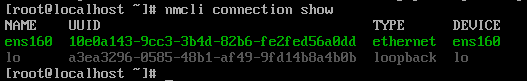

# 네트워크 기본 개념과 인터페이스 구성 이해

## 네트워크 기본 구조

### L1 (Physical) / L2 (Data Link)
- 전기 신호가 오가고, MAC 주소를 통해 옆집 컴퓨터를 찾는 단계 (이더넷, Wi-Fi)
  
### L3 (Network)
- IP 주소를 통해 전 세계 어디로 데이터를 보낼지 정하는 단계 (IP, Routing)

### L4 (Transport)
- 데이터가 안 깨지고 잘 갔는지 확인하는 단계 (TCP, UDP)

### L5 - L7 (Application)
- 애플리케이션이 데이터를 주고받는 단계 (HTTP, DNS, SSH)

## 리눅스 내부 네트워크 동작 구조
```
[ User Space ]                      [ Kernel Space ]
[ User Space ]                                     [ Kernel Space ]
  +-----------------------+                         +---------------------------+
  | UI / nmcli / Cockpit  |                         |    Network Stack (TCP/IP) |
  +----------+------------+                         |  (Packet Processing, L3/L4)|
             | (D-Bus)                              +------------^--------------+
  +----------v------------+                                      | (Internal)
  |   NetworkManager      | <--- (Netlink Socket) ---+           |
  |   (System Daemon)     |      (Config/Events)     |    +------v--------------+
  +----------+------------+                          +----> Network Interface   |
             |                                            | (eth0, wlan0, lo)   |
  +----------v------------+                          +----> (Logical Device)    |
  |  Connection Profiles  |                          |    +------^--------------+
  | (Config: IP, DNS...)  |                          |           | (Hard Control)
  +-----------------------+                          |    +------v--------------+
                                                     +---->  Network Drivers    |
                                                          | (Hardware Support)  |
                                                          +----------^----------+
                                                                     |
                                                          +----------v----------+
                                                          |  Physical NIC (HW)  |
                                                          +---------------------+
```

### NetworkManager Deamon 
- 사용자의 cli 명령을 실행하는 관리 시스템 

### Netlink Socket
- 커널 내부의 네트워크 테이블에 접근할 권한을 가진 소켓
- 커널에서 발생하는 이벤트를 NetworkManager에게 실시간으로 알려주는 통로 

### Network Driver 
- 전달받은 명령을 실제 하드웨어(NIC)가 이해할 수 있는 전기 신호나 제어 명령으로 변경 

### Network Interface
- 하드웨어마다 전송 방식이 달라 커널이 독립적으로 제어하고 트래픽을 분산하기 위한 하드웨어 추상화
    - `eth0` : 첫 번째 이더넷(유선) 카드
    - `wian0`: 무선 랜카드
    - `lo` : 루프백 (자기 자신과의 통신용)
    - `docker0` / `veth` : 가상 머신이나 컨테이너를 위한 가상 인터터페이스 
  
### Kernel Network Stack
- 데이터 처리를 담당하는 부분
- Network Manager는 L3(IP/Routing)와 L2(Link/Auth) 설정

### Connection Profiles 
- 특정 네트워크에 접속하기 위한 설정값들의 묶음 (L3 정보)
``` bash
$ nmcli connection show
```


## 네트워크 동작 흐름

### 제어 흐름
1. 유저가 nmcli로 명령

2. NetworkManager가 Connection Profile에서 비번과 IP 정보를 가져옴

3. Netlink Socket을 통해 Network Interface에게 설정 적용 명령

4. Kernel은 해당 인터페이스의 주소 정보를 업데이트

### 데이터 흐름
1. 웹 브라우저가 데이터 전송

2. Network Stack이 데이터를 패킷으로 쪼개고(L4), NM이 미리 설정해둔 커널 메모리의 라우팅 테이블을 참조하여 IP 헤더 생성(L3)

3. 커널은 Network Interface를 통해 패킷을 Network Driver로 전송

4. Driver는 이를 전기 신호로 바꿔 Physical NIC를 통해 밖으로 전송
