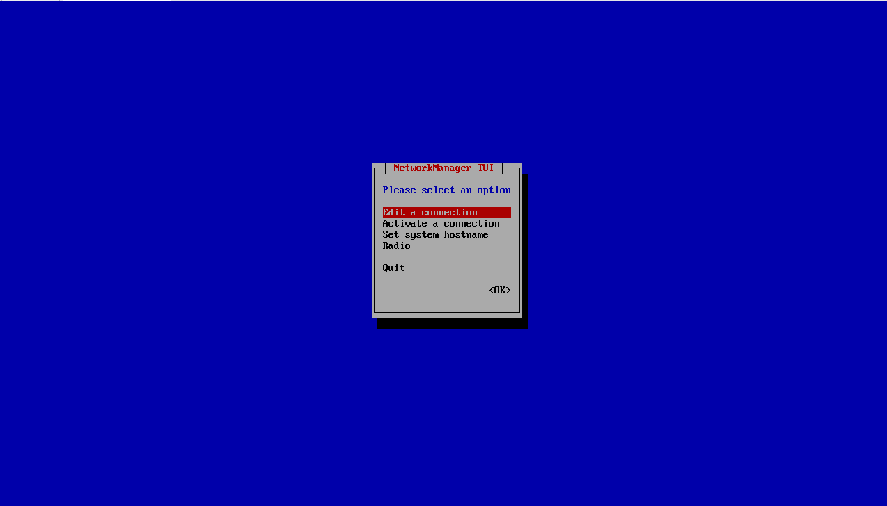
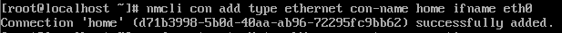
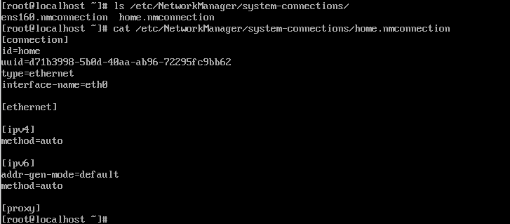
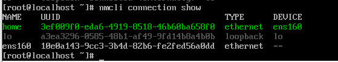
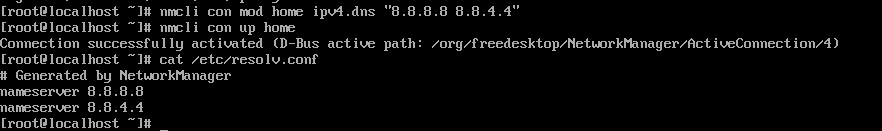

# nmcli·nmtui를 활용한 IP/게이트웨이/DNS 설정

## 네트워크 설정 도구

### nmcli (Network Manager Command Line Interface)
- 텍스트 명령어를 통해 네트워크를 제어하는 강력한 도구
- 자동화 및 상세 설정 가능 

### nmtui
- 터미널 안에서 그래픽 UI 처럼 방향키와 엔터키로 조작하는 도구
``` bash
$ nmtui
```

- Edit a connection : Connection Profile 생성 및 수정
- Activate a connection : 특정 프로필을 선택하여 즉시 연결
- Set system hostname : 서버 호스트명 변경 

## Connection Profile 관리

### 프로필 생성 및 삭제
``` bash
$ nmcli con add type ethernet con-name home ifname eth0
```


- `connection` : 기본 정보  
- `ethernet` : MAC 주소나 패킷 크기와 같은 L2 관련 상세 정보 설정
- `ipv4` / `ipv6` : IP 설정



### 정적 IP (Static)
``` bash
# 1. IP와 서브넷 마스크 설정 (L3 주소)
$ nmcli con mod my-office ipv4.addresses 192.168.1.100/24

# 2. 게이트웨이 설정 (기본 라우팅 경로)
$ nmcli con mod home ipv4.gateway 192.168.1.1

# 3. 할당 방식을 수동(manual)으로 변경
$ nmcli con mod home ipv4.method manual

# 4. 설정 적용
$ nmcli con up home
```
###  자동 IP(DHCP) 설정
``` bash
$ nmcli con mod home ipv4.method auto
$ nmcli con up home
```

## DNS 설정

### DNS 서버 지정
``` bash
# 구글 DNS(8.8.8.8)를 설정
$ nmcli con mod home ipv4.dns "8.8.8.8 8.8.4.4"
$ nmcli con up home
```

- nmcli 명령어로 설정 시 NetworkManager 데몬이 정보를 가지고 있다가 연결 활성화 시 `/etc/resolv.conf` 파일을 자동 수정

## 상세 속성 제어

### 메트릭과 라우팅 우선순위
``` bash
$ nmcli con mod home ipv4.route-metric 100
```
- 메트릭의 값을 수정하여 커널의 라우팅 테이블에서 동일한 목적지 경로가 여러 개일때 메트릭 숫자가 가장 작은 인터페이스 선택 
    -> 내부망이 아닌 외부망을 우선하여 통신하려 할 때 설정

### IPv6 비활성화
``` bash
$ nmcli con mod home ipv6.method ignore
```
- 보안 취약점과 애플리케이션 오류를 방지하기 위하여 설정 