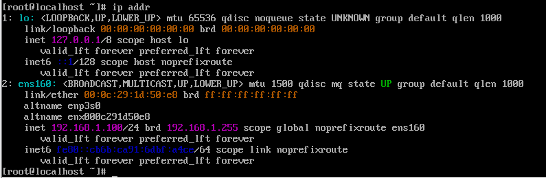
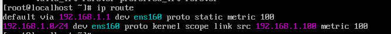
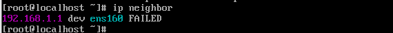
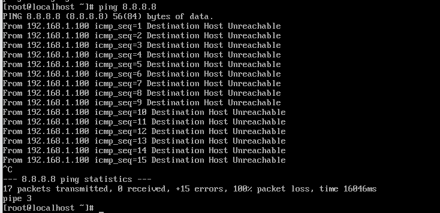
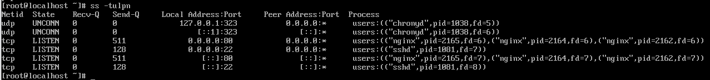
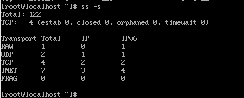

# 네트워크 상태 점검 도구 활용(ping, ss, ip)

## L3 상태 점검 : ip
- 커널 스페이스 내부에 저장된 실시간 데이터 직접 조회
### 주소 확인
``` bash
$ ip addr
```

- 인터페이스에 IP가 잘 설정되었는지 확인  
  -> 네트워크 설정 변경 이후 실제로 커널 메모리에 주소가 잘 들어갔는지 확인하는 경우 / 서버에 IP 주소 자체가 없는지(DHCP 실패 등) 확인하는 경우

### 라우팅 테이블 확인
``` bash
ip route
```

- 게이트웨이 및 우선순위 설정 확인  
  -> 컴퓨터끼리는 통신이 되는데 외부 네트워크로 통신이 잘 되지 않는 경우 

### 주변 장치와 통신 준비가 되었는지 확인
``` bash
$ ip neighbor
```

- Network Stack과 Network Interface 사이의 ARP 캐시 테이블 확인  
    -> 목적지 IP 주소에 대응하는 상대방의 MAC 주소를 알고있는지 확인  
    => 동일한 네트워크 대역 내의 서버끼리 통신이 되지 않는 경우 시도 

## L3 연결성 확인 : ping (ICMP)

### 서버 도달 확인
``` bash
$ ping <IP/Domain>
```

- Network Stack → Network Interface → Physical NIC를 거쳐 외부 네트워크망 전체를 확인  
  -> 상대방 서버가 살아있는지 확인하는 경우 / 네트워크 응답 속도가 평소보다 느린지 확인하는 경우 

## L4 세션 및 포트 점검: ss (Socket Statistics)
- 커널 네트워크 스택 내부에 존재하는 소켓 테이블 정보 직접 조회 

### 열린 포트 및 프로세스 확인
``` bash
$ ss -tulpn
```

- 네트워크 스택의 상단부를 확인하여 커널이 어떤 서비스를 위해 어떤 포트를 열고 있는지 확인  
    -> 실제 커널이 어떤 포트를 열고 있는지 확인하는 경우 / 특정 포트를 어떤 프로세스가 점유하고 있는지 확인하는 경우 

### 전체적인 프로토콜 통계 확인
``` bash
$ ss -s
```

- 네트워크 스택 전체의 요약 통계  
    -> 현재 동시 접속자(TCP) 수를 확인하는 경우 / 비정상적인 커넥션이 쌓여 리소스를 먹고 있는지 확인하는 경우 