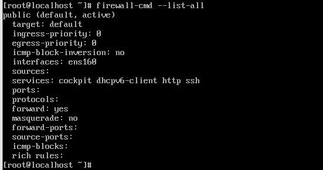

# 방화벽(firewalld) 정책 설정

## 방화벽 아키텍쳐
```
[ User Space ]                                     [ Kernel Space ]
  +-----------------------+                         +---------------------------+
  | firewall-cmd (CLI)    |                         |    Network Stack (TCP/IP) |
  +----------+------------+                         |  +---------------------+  |
             | (D-Bus)                              |  |  Netfilter (Hooks)  |  |
  +----------v------------+                         |  |  (nftables 엔진)     |  |
  |    firewalld          | <--- (nftables API) ----+  +----------^----------+  |
  |   (System Daemon)     |                         +------------|--------------+
  +----------+------------+                                      | (Packet In/Out)
             |                                          +--------v--------------+
  +----------v------------+                             |   Network Interface   |
  |   Zone & Service      |                             |   (ens160, wlan0)     |
  |   (XML Config Files)  |                             +-----------------------+
  +-----------------------+
  ```

### Zone
- 방화벽 정책을 인터페이스별로 묶어서 관리하는 단위 (public, internal 등으로 분류)
- NetworkManager의 프로필이 활성화될 때, 해당 장치에 설정된 Zone이 자동으로 커널에 적용

### nftables API
- firewalld 데몬이 내린 명령을 커널이 이해할 수 있도록 번역하여 전달

  
## 정책 조회 및 설정

### 정책 조회
``` bash
$ firewall-cmd --list-all
```

- public Zone 설정 (default)
- `services` : 현재 방화벽에 통과할 수 있는 포트 목록 

### 서비스 방식의 설정
``` bash
$ firewall-cmd --add-service=http
```
- 일반적으로 사용되는 프로토콜 서비스 이름으로 방화벽 설정

### 포트 방식의 설정
``` bash
$ firewall-cmd --add-port=8080/tcp
```
- 특정 숫자 번호 직접 지정

### 정책 영구 설정
```
[ User Space (Disk) ]              [ Kernel Space (RAM) ]
+---------------------+            +---------------------------+
| XML Config Files    |            |   Netfilter (nftables)    |
| (/etc/firewalld/..) |            |   (실제 패킷 차단 엔진)    |
+----------+----------+            +-------------^-------------+
           |                                     |
    (2) --reload 시 주입                  (1) 즉시 반영 (임시)
           |                                     |
           +---------- [ firewalld ] ------------+
                           ^
                           | (명령 전달)
                    [ firewall-cmd ]
```
| 구분 | Runtime (실시간 적용) | Permanent (영구 저장) |
| - | - | - |
| 명령어 | `firewall-cmd` (옵션 없음) | `firewall-cmd --permanent` |
| 반영 지점 | Kernel Space (RAM) | User Space (Disk) |
| 지속성 | 재부팅/서비스 재시작 시 삭제 | 재부팅 후에도 유지 |