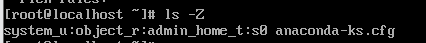
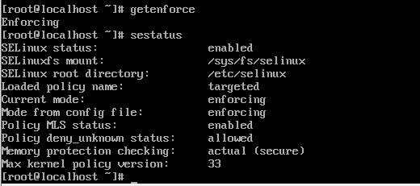

# SELinux 동작 방식과 기본 보안 정책 이해

## SELinux의 탄생

### SELinux가 생겨난 이유
- 전통적 방식 (DAC : Discretionary Access Control)  
  - root 사용자가 모든 파일을 읽고 쓰고 지울 수 있음  
    -> root 권한만 얻는다면 서버 전체가 털릴 수 있음

- SELinux 방식 (MAC : Mandatory Access Control)  
    - 권한 중심이 역할  
    -> root 권한이 탈취되더라도 프로세스의 타입에 따라 타입의 정책이 정의되지 않은 파일에는 접근 불가능 

## SELinux 아키텍처
```
[ User Space ]                         [ Kernel Space (Network + Security) ]
+---------------------+               +------------------------------------------+
|  Apache (httpd)     |               |    Network Stack (TCP/IP)                |
|  (주체: Subject)      |               |  +------------------------------------+ |
+----------+----------+               |  |  LSM (Linux Security Module)        | |
           |                          |  |  +--------------------------------+ | |
    (1) 시스템 호출 -------------------+--> |  SELinux 엔진 (검문소)           | | |
        (파일/소켓 요청)                |  |  +--------------------------------+ | |
           |                          |  +------------------^-----------------+ |
           |                          +---------------------|-------------------+
           |                                                |
           |                          +---------------------v-------------------+
           v                          |        Target (Object)                  |
[ 파일 / 네트워크 포트 ] <---------------+      (데이터가 담긴 자원들)               |
+---------------------+               +-----------------------------------------+
```

### LSM (Linux Security Module)
- 커널의 기본 기능과 보안 모듈을 연결해주는 인터페이스
- 프로세스가 자원에 접근하려고 할 때, 요청을 까로채서 등록된 보안 엔진에게 전달 

### SELinux 엔진
- 정책 데이터베이스를 기반으로 접근 허용 여부를 최종 결정하는 시스템

### Target
- 프로세스에 의해 사용되는 모든 자원
- 고유한 라벨이 붙어 있어 SELinux엔진이 보고 식별 가능 

## 컨텍스트 
- 이름이 아닌 라벨을 활용하여 대상 식별

### 컨텍스트 구조
``` bash
$  ls -Z
사용자:역할:타입:보안수준
```

- 사용자 : `system_u` (SELinux 내부 사용자)
- 역할 : `object_r` (객체/파일)
- 타입 : `admin_home_t` (root의 홈 디렉토리에 있는 자원)
- 보안 수준 : `s0` (다중 보안 수준 체계에서 가장 낮은 민감도)

### 라벨링에 따른 동작
- 프로세스가 라벨을 부여받아 해당 라벨의 접근 권한이 허용되는만큼 객체 접근 

### 라벨의 이동
- 상속 : 파일을 새로 만들면 해당 파일이 위치한 부모 디렉토리의 라벨을 물려받음
- 이동 : 기존 위치의 라벨을 그대로 유지

### 라벨 수정
``` bash
$ restorecon -v [파일명]
```
- 파일의 라벨을 정책에 정의된 원래 있어야 할 라벨로 원복 

## SELinux 동작 모드

### Enforcing (강제 모드)
- SELinux가 활성화 되어 있어 보안 정책을 엄격하게 강제 
    -> 정책에 어긋나는 동작이 감지되면 즉시 차단 후 로그 남김

### Permissive (허용 모드)
- SELinux가 활성화는 되어 있지만 정책을 강제x
- 디버깅 용도로 활용 가능 

### Disabled (비활성화 모드)
- SELinux 엔진 자체가 완전히 꺼진 상태

### 현재 동작 모드 확인
``` bash
$ sestatus
```
